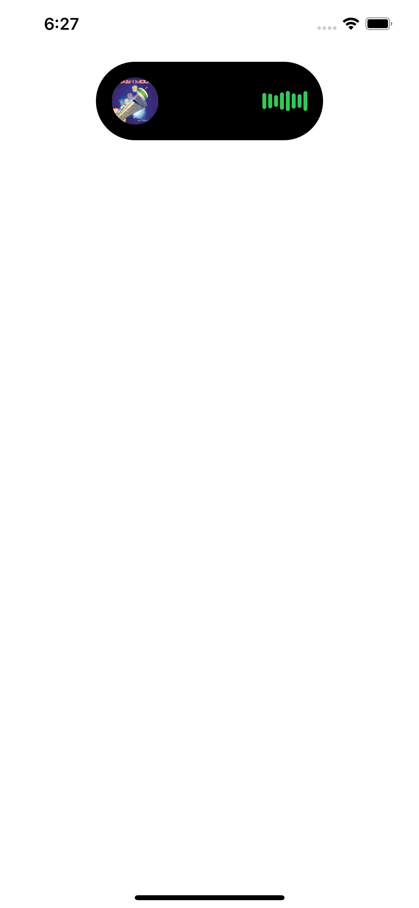

## Dynamic Island Demo

A demo of Apple's Dynamic Island component previewing a Spotify song written in **SwiftUI**.
***

#### Demo

 

This was a quick 60 minute SwiftUI challenge to recreate this component from another user's Figma mockup. It was pretty straightforward; there were no major roadblocks during development 

### Overall Design
  

The overall UI design is pretty clean and Apple-esque. I took the liberty to spruce up the AudioVisualizer component and make it green. 

> At some point I may revisit this project and make the card a bit more reusable. There isn't much code though so it may not be necessary. 

### Conclusion

This was a fun little SwiftUI exercise that takes less than an hour to implement. If you're feeling up to it then take on the challenge yourself! 

